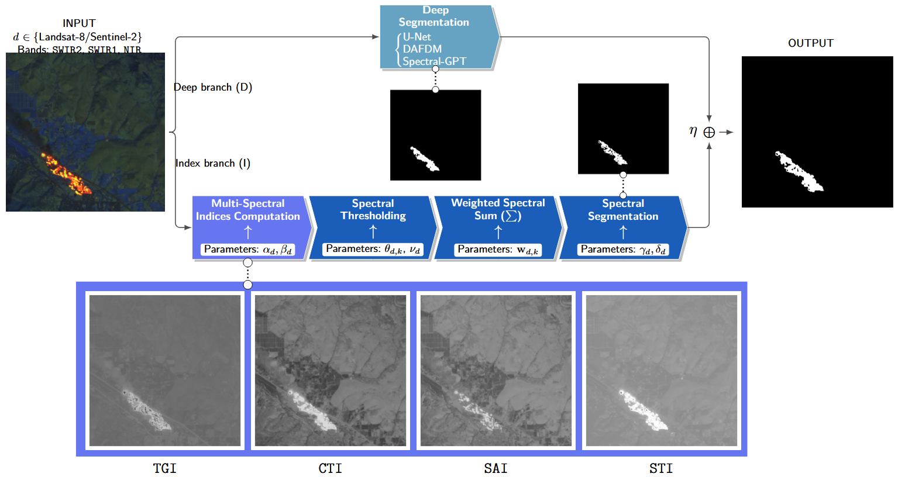

# Exploring Contextual and Interpretable Spectral Learning for Active Fire Segmentation using Multi-Sensor Landsat-8 and Sentinel-2 Data

This is the official repository for the paper "Exploring Contextual and Interpretable Spectral Learning for Active Fire Segmentation using Multi-Sensor Landsat-8 and Sentinel-2 Data".

[André M. Fusioka](https://github.com/Minoro), [Gabriel H. de Almeida Pereira](https://github.com/Minoro), [Bogdan T. Nassu](https://github.com/btnassu), David Menotti, [Rodrigo Minetto](https://github.com/rminetto).

A novel hybrid neural network for active fire segmentation, fusing deep semantic backbones with learnable spectral indices for multi-sensor Landsat-8 and Sentinel-2 data.


## Citation
If you find this work useful in your research, please consider citing our paper:
```bibtex
@article{Fusioka2026,
  title={Exploring Contextual and Interpretable Spectral Learning for Active Fire Segmentation using Multi-Sensor Landsat-8 and Sentinel-2 Data},
  author={Fusioka, André M and Pereira, Gabriel H de Almeida and Nassu, Bogdan T and Menotti, David and Minetto, Rodrigo},
  year={2026}
}
```

## Abstract

Active fire detection from satellite imagery is critical for environmental monitoring, disaster response, and climate studies. However, existing methods suffer from the lack of interpretability in deep learning models and the rigidity of threshold-based methods, especially under multi-sensor scenarios. To address these limitations, in this work we propose a hybrid dual-branch architecture that integrates hierarchical semantic feature extraction from deep architectures, with an explicit learnable spectral decision module. The proposal is explicitly designed for joint Landsat-8 and Sentinel-2 data, exploring spectral wavelength similarities for active fire. A key component of our architecture, is a modular threshold based branch that can operate either jointly with different deep backbones or independently, explicitly encoding spectral index–based decision rules through a differentiable formulation. Experiments on representative wildfire segmentation datasets show that the proposed method outperforms a traditional thresholding method, standalone deep models, and a recent foundation model, reaching 89.0% precision, 85.1% recall, and 86.8% F1-score. Analysis of the learned parameters reveals consistent yet sensor-specific decision boundaries, highlighting the adaptability of the approach across satellite sensors. Code, datasets, and trained models are publicly available on GitHub.

## Overview

We propose a hybrid approach to active fire segmentation that combines the strengths of deep learning and spectral index-based methods. The architecture consists of two branches: a deep semantic branch that extracts hierarchical features from the input imagery, and a learnable spectral decision branch that explicitly encodes spectral index-based decision rules. The spectral decision branch is designed to be modular, allowing it to operate either jointly with different deep backbones or independently. This design enables the model to adapt to multi-sensor scenarios, leveraging the spectral similarities between Landsat-8 and Sentinel-2 data for active fire detection. The following figure illustrates the proposed architecture:




## Environment Setup

We built our code using Python 3.10 and PyTorch 2.1.0. We provide a `requirements.txt` file with all the necessary dependencies to run the code, however we recommend using the Dockerfile provided in the repository to create a consistent environment for training and evaluation. The Dockerfile sets up the necessary libraries and tools to ensure that the code runs smoothly across different platforms. To build the Docker image, navigate to the root directory of the repository and run the following command:
```bash
docker build -t active-fire-segmentation:latest .
```
This command will create a Docker image named `active-fire-segmentation` with the latest tag. In our experiments, we define a internal dataset path as `/dataset/`, which is the path where the datasets should be mounted when running the Docker container. Make sure that the Landsat-8 dataset is mounted at `/dataset/Landsat` and the Sentinel-2 dataset is mounted at `/dataset/Sentinel2`. You can adjust this path as needed when running the container:

```bash
docker run -it --rm \
 -v /path/to/Landsat:/dataset/Landsat \
 -v /path/to/Sentinel2:/dataset/Sentinel2 \
 --mount type=bind,src="$(pwd)",target=/hybrid-fire-segmentation --gpus all \
  active-fire-segmentation:latest
```
Besides the normal dependencies, the Docker image also includes a Jupyter Notebook server, allowing you to run the code and experiments in an interactive environment. Also, by default the container will start a bash terminal, so you can run the training scripts and evaluation scripts directly from the terminal, or you can start the Jupyter Notebook server to run the code in a notebook environment. To start the Jupyter Notebook server, run the following command inside the container:
```bash
jupyter lab --ip=0.0.0.0 --allow-root
``` 

All comands will consider the use of the Docker container and the default bash.


### Datasets

In order to evaluate the proposed method, we use two representative wildfire segmentation datasets: the [Landsat-8 Active Fire Dataset](https://github.com/pereira-gha/activefire), provided by Pereira et al., and the [Sentinel-2 Active Fire Dataset](https://github.com/Minoro/transfer-learning-landsat8-sentinel2). These datasets contain annotated satellite imagery of active fire events, captured by the respective sensors. The datasets are preprocessed to ensure consistency in spatial resolution and spectral bands, allowing for effective training and evaluation of the proposed model. As in the work [Active Fire Segmentation: A Transfer Learning Study From Landsat-8 to Sentinel-2](https://ieeexplore.ieee.org/document/10620606), we have made a small change in the dataset Sentinel-2 dataset, we chose to not use the patches with "no-data". You can use the `crop_dataset.py` script provided in the `src` folder to crop the datasets in the same way. The script takes as input the path to the dataset and the output path for the cropped patches. You can run the script as follows:

```bash
python src/crop_dataset.py --input_path /path/to/dataset --output_path /path/to/cropped_patches
``` 

Assuming that you downloaded the Sentinel-2 dataset at `/dataset/Sentinel2`, you can run the following commands to crop the images:

```bash
# Crop Sentinel-2 images
python src/crop_dataset.py --input_path /dataset/Sentinel2/manual_annotated/scenes/stack_20m/ --output_path /dataset/Sentinel/gdal_croped/imgs_256

# Crop Sentinel-2 annotations
python src/crop_dataset.py --input_path /dataset/Sentinel2/manual_annotated/scenes/stack_20m/ --output_path /dataset/Sentinel/gdal_croped/annotations
``` 

To train the models, we splited the datasets into 5-folds, with train, validation and test sub-sets. We used 3 folds for training, 1 fold for validation and 1 fold for testing. The splits are provided in the `resources/folds/landsat-sentinel/` folder, with the following structure:

```
resources/folds/landsat-sentinel/
├── landsat-sentinel_folds_gdal_croped.csv
|── landsat_extracted_folds_gdal_croped.csv
|── sentinel_extracted_folds_gdal_croped.csv
```

If you want to make your own splits, you can use the `create_folds.py` script provided in the `src/active_fire` folder.


## Active Fire Segmentation Models

The proposed method is evaluated against several baselines, including a traditional thresholding method, standalone deep models, and a recent foundation model. Specifically, we compare our approach to the following methods:

- **Index-Based Method**: A traditional approach that applies learnable thresholds to spectral indices for fire detection.
- [**U-net**](https://arxiv.org/abs/1505.04597): A widely used deep learning architecture for image segmentation, trained independently on each sensor's data.
- [**DAFDM**](https://ieeexplore.ieee.org/document/10902470): A recent model designed specifically for active fire detection.
- [**SpectralGPT**](https://github.com/danfenghong/IEEE_TPAMI_SpectralGPT): A foundation model for spectral remote sensing tasks, with small modifications.


## Training the Models

In order to train the models, we provide the source in the `src` folder, which contains the implementation of the proposed architecture, as well as the training scripts for each of the baselines. We created a script for each model, which can be run from the terminal. For example, to train the proposed method, you can run the following command:
```bash 
python index_branch.py
```

Inside the script you can adjust the hyperparameters, such as the learning rate, batch size, number of epochs, and the fold to be used for training.
